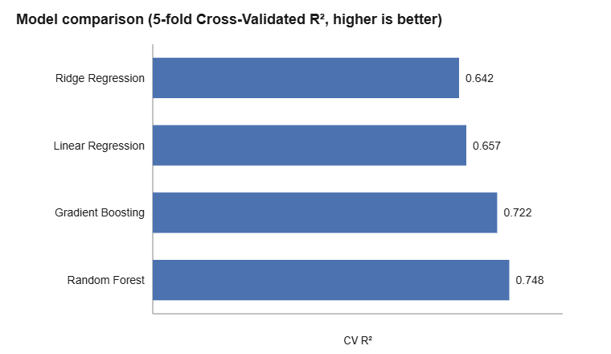
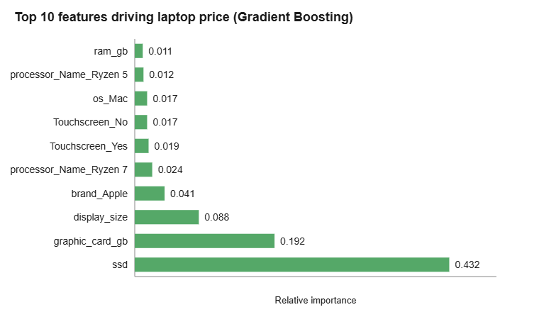

# Laptop Price Prediction

Predicting laptop prices from hardware specifications (brand, processor, RAM, storage, GPU, display size, and more) using regression models, with a full data-cleaning pipeline and a comparison of four regression algorithms.

## Overview

Laptop pricing depends on a mix of categorical and numeric specs that interact in non-linear ways (e.g. a dedicated GPU matters more on a gaming laptop than a budget one). This project builds a spec-to-price regression pipeline: cleaning a messy real-world dataset, encoding categorical features, and comparing linear and tree-based models using cross-validation rather than a single train/test split.

## Problem Statement

Given a laptop's specifications, predict its price (in ₹). This is a supervised regression problem with a right-skewed target and a mix of 9 categorical and 7 numeric features.

## Dataset

`data/Cleaned_Laptop_data.csv` — 845 laptop listings, 18 columns (brand, processor details, RAM, storage, GPU, display size, OS, weight category, touchscreen, MS Office bundled, warranty, and price).

Despite the filename, the raw data required real cleaning before it was usable:

- **Two columns were mislabeled at the source**: `Apps` actually contains RAM type (DDR4, LPDDR4X, ...) and `weight` actually contains a weight *category* (Casual / ThinNlight / Gaming), not a numeric weight. Renamed to `ram_type` and `weight_category`.
- **Inconsistent brand casing** — `lenovo` and `Lenovo` were being treated as two different brands. Normalized with `.str.title()`.
- **`display_size` stored as text** with a few corrupted/shifted values. Coerced to numeric, dropping rows that failed to parse.
- **3 rows missing the target price** and **9 exact duplicate rows** — dropped.
- **`model` has 116 near-unique values across 845 rows** (mostly singleton categories). It doesn't generalize and risks memorization, so it was dropped as a feature entirely.

After cleaning: 830 rows, 17 features.

## Methodology

1. **Cleaning** as described above (see `load_and_clean()` in `src/laptop-price-prediction.py`).
2. **Target transformation** — `Price` is right-skewed (a handful of high-end/gaming laptops pull the mean well above the median), so the model is trained on `log1p(Price)` and predictions are converted back with `expm1()` for evaluation in real ₹ terms.
3. **Preprocessing** — categorical columns one-hot encoded (`handle_unknown="ignore"`) via `ColumnTransformer`; numeric columns passed through unchanged.
4. **Models compared**: Linear Regression, Ridge Regression, Random Forest, Gradient Boosting.
5. **Evaluation** — both a single 80/20 held-out test split *and* 5-fold cross-validated R², since a single split is highly sensitive to which high-end outlier laptops happen to land in the test set. CV R² is the primary metric used to compare models.

## Results

| Model | Test R² | Test MAE (₹) | Test RMSE (₹) | CV R² (mean) | CV R² (std) |
|---|---|---|---|---|---|
| Random Forest | 0.497 | 16,389 | 35,483 | **0.7475** | 0.0520 |
| Gradient Boosting | 0.598 | 16,342 | 31,721 | 0.7221 | 0.0341 |
| Linear Regression | -0.304 | 20,096 | 57,153 | 0.6574 | 0.0295 |
| Ridge Regression | -0.583 | 20,896 | 62,954 | 0.6422 | 0.0202 |

**Why Linear/Ridge show a negative test R² despite a reasonable CV R²:** in the single 80/20 split, a small number of high-end laptops land in the test set that a linear model can't extrapolate to — a few large misses dominate the sum of squared errors. Averaged over 5 different cross-validation splits, their R² is a much more reasonable ~0.64–0.66. This is exactly why CV R² (not a single test split) is used as the primary comparison metric here, and why tree-based models — which handle non-linear feature interactions and are far less sensitive to individual outliers — are the better fit for this data.

**Baseline vs. fixed pipeline:** before the cleaning steps above (mislabeled columns, brand casing, corrupted `display_size`, high-cardinality `model` column, un-transformed target), a plain Linear Regression baseline scored a 5-fold CV R² of **-0.20** — worse than predicting the mean. Cleaning the data and transforming the target turned this into a usable model, with Gradient Boosting and Random Forest reaching **0.72–0.75** CV R².

**Feature importance** (from the best-performing Gradient Boosting model): storage (`ssd`), dedicated GPU memory (`graphic_card_gb`), and display size are the strongest price drivers, followed by brand (Apple carries a clear premium) and high-end processors (Ryzen 7).




Remaining error (MAE ≈ ₹16k on a dataset spanning ₹14k–₹442k) is reasonable for a spec-only model — identical specs are sold under different brands and retail markups, which specs alone can't fully capture.

## Tech Stack

- Python 3
- pandas, NumPy
- scikit-learn (Linear Regression, Ridge, Random Forest, Gradient Boosting, `ColumnTransformer`, `OneHotEncoder`, `Pipeline`)
- matplotlib, seaborn
- Jupyter Notebook

## Project Structure

```
laptop-price-prediction/
├── data/
│   └── Cleaned_Laptop_data.csv
├── notebooks/
│   └── laptop-price-prediction.ipynb   # full analysis with narrative + charts
├── src/
│   └── laptop-price-prediction.py      # standalone script version
├── assets/
│   ├── model_comparison.png
│   └── feature_importance.png
└── README.md
```

## How to Run

```bash
git clone https://github.com/Akash-Nion/laptop-price-prediction.git
cd laptop-price-prediction
pip install pandas numpy scikit-learn matplotlib seaborn jupyter

# Run the script version
cd src
python laptop-price-prediction.py

# Or explore the full notebook
cd ../notebooks
jupyter notebook laptop-price-prediction.ipynb
```

## Author

**Akash Nion Rahaman**
B.Sc. in Mathematics · Postgraduate Diploma in Data Science

